# Лабораторная работа №1. Бинаризация с адаптивным порогом

Вариант 2, бинаризация с адаптивным порогом. Из двух методов на выбор (mean и gaussian) взят mean.

**Цель работы:** научиться реализовывать один из простых алгоритмов обработки изображений.

**Задание:** реализовать алгоритм двумя способами: через готовую функцию библиотеки и вручную на Python и сравнить, насколько они различаются по скорости.

## 1. Теоретическая база

Бинаризация превращает полутоновое изображение в чёрно-белое: каждый пиксель сравнивается с порогом и становится либо белым, либо чёрным.

Проще всего взять один порог на всю картинку. Но это плохо работает, когда освещение неравномерное. Например, на фотографии книжной страницы один край может быть в тени. Если порог подобрать под светлую часть, тёмная целиком уйдёт в чёрный, а если под тёмную - в светлой пропадёт текст.

Адаптивная бинаризация решает эту проблему тем, что порог для каждого пикселя считается отдельно, по его соседям. Вокруг пикселя берётся квадратное окно, по нему считается средняя яркость, и пиксель сравнивается уже с ней. Получается, что вопрос ставится не «тёмный ли этот пиксель», а «темнее ли он, чем то, что вокруг». Буква в тени всё равно темнее бумаги рядом с ней, поэтому она остаётся видна.

У метода два параметра:

- `blockSize` - сторона окна в пикселях. Берётся нечётной, чтобы у окна был центральный пиксель. Маленькое окно хорошо передаёт мелкие детали, но реагирует на шум. Чем окно больше, тем результат ближе к обычной бинаризации с одним порогом.
- `C` - число, которое вычитается из среднего. Без него на ровном фоне примерно половина пикселей случайно оказывается чуть темнее среднего и становится чёрной. Константа даёт запас: чёрным станет только тот пиксель, который темнее соседей заметно.

Отдельный вопрос - края изображения. У пикселя в углу нет соседей с двух сторон, и окно выходит за границы. Недостающие значения достраиваются копированием крайних пикселей.

## 2. Описание разработанной системы

Программа написана на Python и целиком находится в файле `main.py`. Используются:

- OpenCV — чтение изображения и библиотечный вариант бинаризации;
- tkinter — окно программы;
- matplotlib — графики.

### Как работает программа

1. Изображение читается из файла. Если оно больше 600 пикселей по большей стороне, оно уменьшается - иначе реализация на чистом Python работала бы слишком долго.
2. Изображение переводится в оттенки серого.
3. Бинаризация выполняется двумя способами, для каждого засекается время.
4. Те же две реализации запускаются ещё на нескольких размерах изображения и окна, по результатам строятся графики.

Путь к изображению и параметры (`BLOCK_SIZE`, `C` и другие) задаются константами.

### Библиотечная реализация

Функция `threshold_library` - вызов `cv2.adaptiveThreshold` с методом `ADAPTIVE_THRESH_MEAN_C` и типом порога `THRESH_BINARY`.

### Собственная реализация

Функция `threshold_native` делает то же самое обычными циклами, без векторных операций NumPy:

1. Изображение переводится в список списков.
2. Вокруг него достраивается рамка шириной в половину окна, заполненная копиями крайних пикселей. После этого окно помещается вокруг любого пикселя.
3. Для каждого пикселя складываются все значения в окне, сумма делится на число пикселей в окне.
4. Из среднего вычитается `C`. Если пиксель ярче полученного порога, в результат записывается 255, иначе 0.

Алгоритм намеренно сделан самым прямым способом: сумма по окну для каждого пикселя считается заново.

## 3. Результаты работы и тестирования

### Окно программы

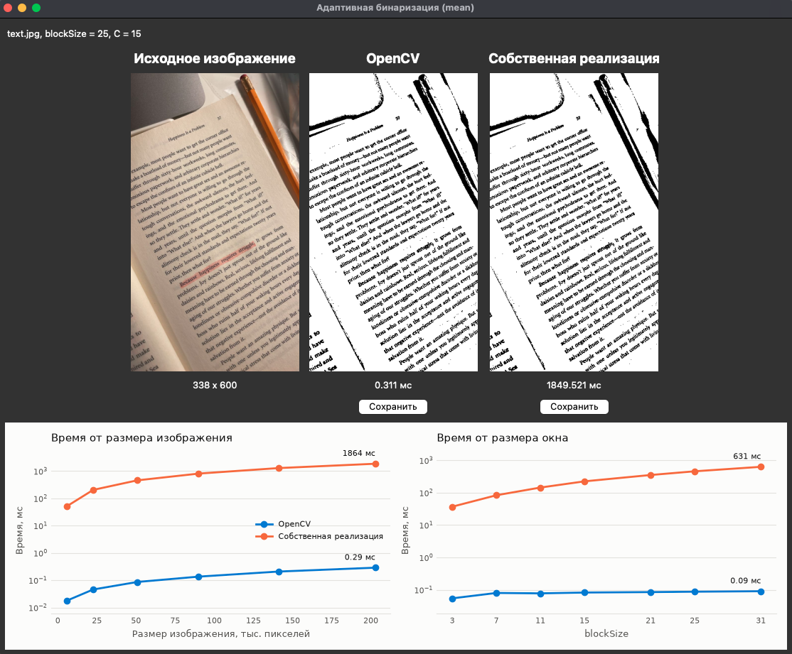

### Результат бинаризации

Основное тестовое изображение - фотография книжной страницы.

| Исходное | OpenCV | Собственная реализация |
|---|---|---|
| 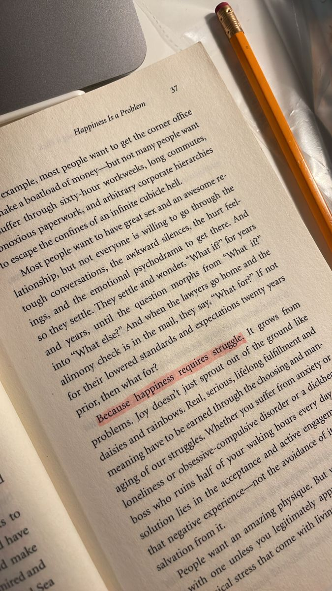 | 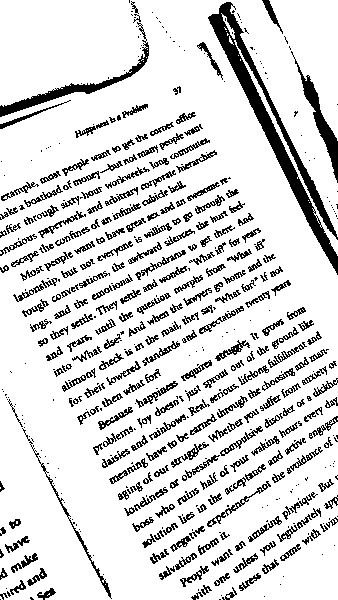 | 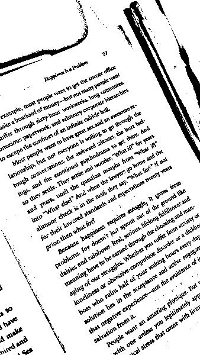 |

Второе изображение - фотография автомобиля.

| Исходное | OpenCV | Собственная реализация |
|---|---|---|
|  | 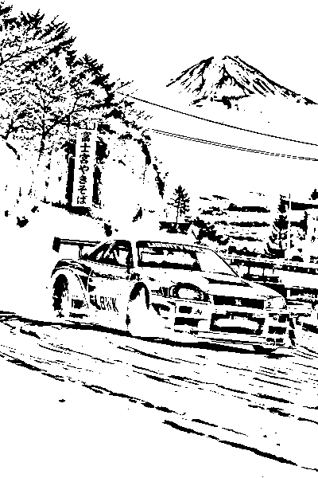 |  |

### Влияние параметров

При `blockSize = 11` и `C = 2` поля страницы покрываются зерном: окно маленькое, запас почти нулевой, и порог срабатывает на текстуре бумаги. При `blockSize = 25` и `C = 15` фон становится чистым.

| blockSize = 11, C = 2 | blockSize = 25, C = 15 |
|---|---|
| 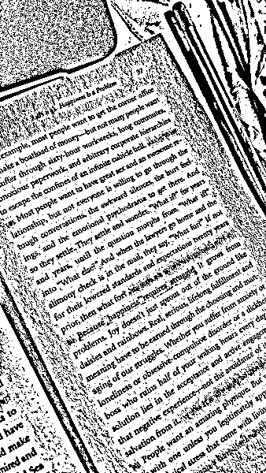 |  |

Разные `blockSize` при `C = 15`.

| blockSize = 5 | blockSize = 25 | blockSize = 101 |
|---|---|---|
| 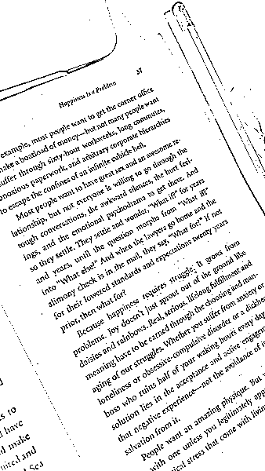 |  | 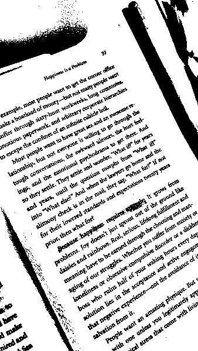 |

Разные `C` при `blockSize = 25`.

| C = 0 | C = 15 | C = 40 |
|---|---|---|
| 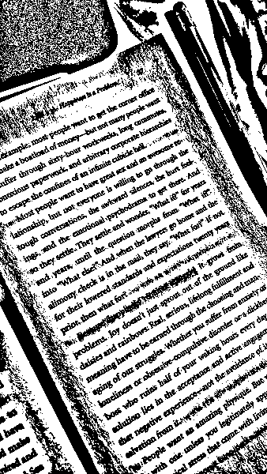 |  | 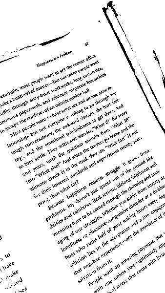 |

### Быстродействие

Время в зависимости от размера изображения (`blockSize = 25`):

| Размер | Пикселей | OpenCV, мс | Собственная, мс | Во сколько раз медленнее |
|---|---|---|---|---|
| 56×100 | 5 600 | 0,019 | 51 | 2 700 |
| 113×200 | 22 600 | 0,060 | 229 | 3 800 |
| 169×300 | 50 700 | 0,088 | 468 | 5 300 |
| 225×400 | 90 000 | 0,145 | 813 | 5 600 |
| 282×500 | 141 000 | 0,213 | 1 265 | 6 000 |
| 338×600 | 202 800 | 0,285 | 1 862 | 6 500 |

Время в зависимости от размера окна (изображение 169×300):

| blockSize | OpenCV, мс | Собственная, мс | Во сколько раз медленнее |
|---|---|---|---|
| 3 | 0,068 | 44 | 640 |
| 7 | 0,079 | 87 | 1 100 |
| 11 | 0,080 | 144 | 1 800 |
| 15 | 0,083 | 266 | 3 200 |
| 21 | 0,086 | 375 | 4 400 |
| 25 | 0,088 | 470 | 5 300 |
| 31 | 0,092 | 653 | 7 100 |

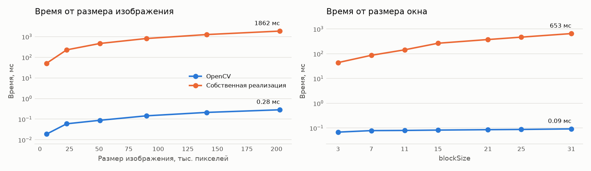

### Закономерности

- Время собственной реализации растёт пропорционально числу пикселей: изображение стало больше в 36 раз, время выросло тоже в 36 раз. Это ожидаемо, потому что порог считается для каждого пикселя отдельно.
- Время собственной реализации растёт и с размером окна: от `blockSize = 3` до `31` оно увеличилось примерно в 15 раз. Чем больше окно, тем больше чисел приходится складывать для каждого пикселя.
- Время OpenCV от размера окна почти не зависит: на том же диапазоне оно выросло примерно в 1,4 раза.
- Разница между реализациями составляет от 640 до 7 100 раз и тем больше, чем больше окно.

## 4. Выводы

В работе реализована адаптивная бинаризация методом mean двумя способами: через `cv2.adaptiveThreshold` и вручную на Python.

По скорости библиотечная реализация быстрее моей в тысячи раз. Во-первых, OpenCV - это скомпилированный код на C++, а в Python каждое сложение выполняется интерпретатором. Во-вторых, у OpenCV другой способ подсчёта: его время почти не зависит от размера окна, тогда как моя реализация для каждого пикселя складывает все значения окна заново.

## 5. Использованные источники

1. Документация OpenCV. https://docs.opencv.org
2. Документация Matplotlib. https://matplotlib.org/stable/
3. Документация Python: tkinter. https://docs.python.org/3/library/tkinter.html
